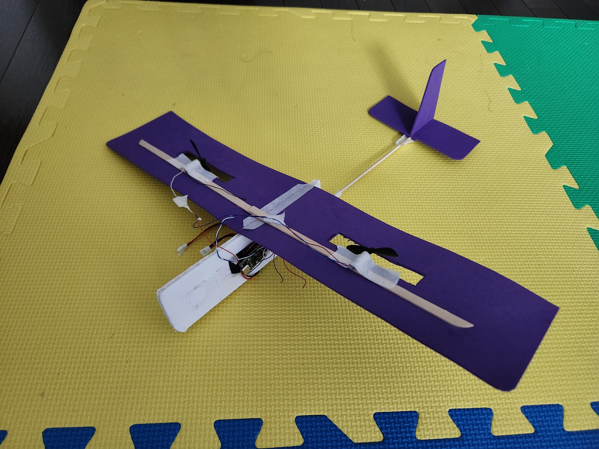
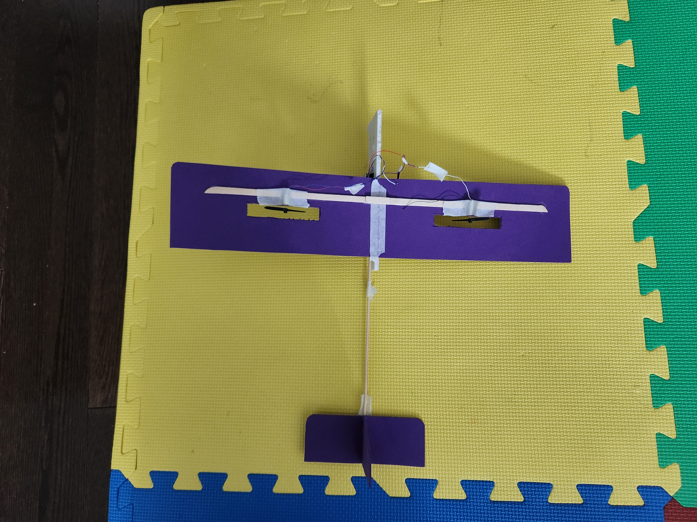

# ESP32 c6 Airplane

## Components

* esp32-c6 supermini from Aliexpress.
* drv8833 from Aliexpress
* 160 mAh lipo
* Two 615 brushed coreless motors

Original idea was to have drv8833 to drive 2 motors on 1st H-bridge, and 2nd H-bridge was to drive a pitch control actuator. While the citcuit worked the actuator I had was not able to hold the elevator flaps, it used to sag. So I just stuck with high angle of attack while flying so that I can control height with throttle and differential control.

## Build

17" wingspan, 15" fuselage, little foam board, a barbecue stick, 1 thick icecream stick split into 4 parts to support windows.
Weight - 25gram (no idea never measured).

### Some Images of the 2nd iteration of the plane

## Controller Project esp32-s3 based
Controller is also custom using esp-now protocol and cheap arduino joysticks (Big Mistake). If anyone is planning to build this DO NOT use the cheap arduino joysticks as they are not electronically centered. (I get 111 as center in the scale of 255). I did have to come up with some calibration logic for my bicopter. But for this plane its still flyable.

DSMX sbus receiver support - I do have provision to attach a dsmx sbus receiver in that board which I use with MLP6DSM controller. But I feel the response time is too slow for indoor flying. So I never use that one. There are a lot of dropped frames.

More details and srouce in this Link [Remote Controller](https://github.com/samarjit/esp32-s3-remote-controller)

